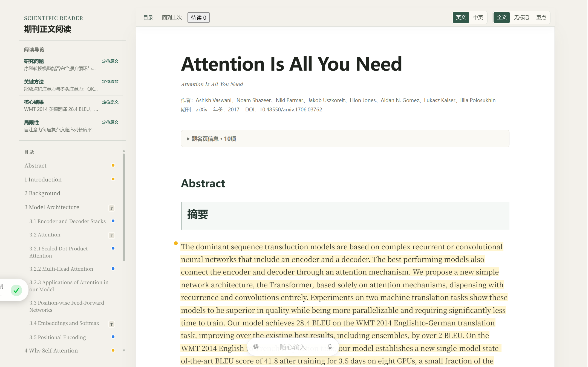

<h1 align="center">Deep Literature for DSH</h1>

<strong>在 DSH 中管理文献，把论文变成可持续积累的双语 HTML 阅读页。</strong>

  
  
  
  

  <a href="#近期更新">近期更新</a> ·
  <a href="#项目简介">项目简介</a> ·
  <a href="#快速开始">快速开始</a> ·
  <a href="docs/getting-started.md">使用指南</a> ·
  <a href="https://github.com/TyrionH-is-coding/deep-literature-for-dsh/issues">反馈问题</a>

## 近期更新

> **2026.09.12 · v0.2.0-rc.2 候选版** — 阅读时随选随问，随记直达 Excel；模型按步骤分工，四套主题一键切换，文献库与设置移入右侧栏。[查看 v0.2 使用指南 →](docs/v0.2-guide.md)

| 这次更新 | 现在可以怎样用 |
| --- | --- |
| **边读边问** | 在在线阅读页选中原文、译文或图注，点击“问 AI”或按 `Alt+Shift+E` 解释，继续追问并跳回引用段落。 |
| **随手记下想法** | “随记”和“问 AI”共用侧面板；摘录、写笔记、保存后打开 Excel，接着整理本文记录。 |
| **给不同步骤选择模型** | 翻译、导读、要点提取与讨论分别设置模型和思考深度，只显示已连接服务的可用模型。连接 Codex 且相应模型可用时，翻译默认 Luna，分析与讨论默认 Sol，思考深度默认 medium。 |
| **围绕论文和图持续讨论** | 每篇论文保留自己的会话，图像连同图注与相关正文送入支持图片的模型；也可选取多篇讨论进行综合。 |
| **更清爽的阅读空间** | 暖纸、纯白、深墨、雾蓝四套主题；文献库与设置使用右侧栏，阅读页左侧目录和导览可收起，按钮与提示更简洁。 |
| **把阅读页带走** | 导出包含正文、译文、公式和图片的单文件 HTML，在电脑或手机浏览器中离线阅读、分享。个人随记与对话不随文件导出。 |
| **按课题整理和发现文献** | 自定义 Excel 列、研究字段与阅读模板；文献雷达按研究方向发现候选论文，由你决定是否入库。 |

以上为 `main` 的 v0.2 候选功能，尚未发布 v0.2 安装包；当前公开包仍为 [v0.1.0-rc.5](https://github.com/TyrionH-is-coding/deep-literature-for-dsh/releases/tag/v0.1.0-rc.5)。尝试候选版请按[源码构建步骤](docs/development.md#从源码构建)操作，升级前备份完整文献库。

<strong>已验证到哪里？</strong>

已完成本地自动化回归、真实 DSH 宿主中的阅读与侧栏交互、模型连接状态和四套主题检查。当前适配 DSH `0.1.5-rc.1`。图像传输使用本地模拟模型校验；真实账号的识图效果、真实旧库升级，以及手机和其他系统的实机使用仍需继续验证。在线问答需要工作台运行；离线 HTML 用于阅读。

## 项目简介

**Deep Literature for DSH** 是 [DeepSeek Harness](https://github.com/deepseek-ai/deepseek-harness) 的原生文献插件。给它 DOI、论文链接或本地 PDF，就能查重入库、补全题录与摘要、生成双语 HTML 阅读页，再用文献库和 Excel 留下笔记。

使用你已有的 **DSH + 模型配置 + MinerU 免费 API Key** 即可开始。插件沿用 DSH 的模型选择，不要求安装 Codex。已有可用本机 MinerU 的用户也可以选择本地解析。

**自动获取开放获取（OA）全文，也支持导入已有 PDF。** 需要高校认证的论文，请在自己的浏览器中取得后补入原任务。

## 从一篇论文，到自己的文献库

| 你想完成什么 | 插件帮你完成 | 留下的成果 |
| --- | --- | --- |
| **收集想读的论文** | 核对题录、去重入库、补全可核实的摘要，按文件夹和标签管理 | 文献信息、摘要与分类 |
| **生成双语 HTML 阅读页** | 解析 PDF 正文、图表和公式，分批翻译与复核 | 中英正文、章节目录、阅读导览与图表 |
| **积累阅读后的思考** | 查看 Excel 总表，记录笔记，保存关闭后同步 | 个人记录、阅读成果与来源位置 |
| **下次接着读** | 查回文献和已有资产，继续中断的原任务 | 保留的 PDF、解析结果、Reader 与任务进度 |

**对话入库 → OA 获取或补入 PDF → 双语 HTML 精读 → 记录与回顾。**

### 看看生成的阅读页

《[Attention Is All You Need](https://arxiv.org/abs/1706.03762)》的 HTML Reader 示例：题名、章节目录、阅读导览与正文重点标注集中在同一页面。

*用户提供的真实 Reader 截图；DSH 版与 Codex 版共用阅读引擎。[配图说明](docs/media/README.md)*

## 快速开始

### 1. 安装到 DSH

需要 **Node.js 22、Python 3.11 和 DSH**。当前验证的 DSH 版本见[安装指南](docs/getting-started.md#环境要求)。

从 [Releases](https://github.com/TyrionH-is-coding/deep-literature-for-dsh/releases) 下载插件 `.tgz` 和 `SHA256SUMS.txt`，核对哈希后，停止准备安装插件的 DSH，执行：

~~~sh
dsh plugin --profile web add "/绝对路径/下载的插件.tgz" --ignore-scripts
~~~

重新启动同一 DSH Profile，新建会话并选择 **“文献模式”**。v0.2 从工作台右上角打开“文献库”或“文献设置”，在右侧栏中使用。公开 v0.1 安装包的入口和完整安装步骤见[使用指南](docs/getting-started.md)。

### 2. 配置模型与 MinerU

| 配置 | 在哪里设置 | 用途 |
| --- | --- | --- |
| **模型服务** | DSH 原生设置连接服务；v0.2 在“文献设置”中按步骤选择模型 | 摘要翻译、全文翻译与阅读讨论 |
| **MinerU 免费 API Key** | 文献设置中的 PDF 解析设置（v0.1 为“设置与状态”） | 将 PDF 解析为正文、图表与公式 |

MinerU Token 可从[官网](https://mineru.net/)的“API 管理 → Token”获取。当前官方说明为每天 **1,000 页最高优先级解析额度**，超出后降低优先级；单文件最多 **200 页、200 MB**。按每篇 10–20 页估算，约相当于每天 50–100 篇论文的高优先级解析，具体以账号页面为准。[官方 API 文档](https://mineru.net/apiManage/docs)（核对于 2026-09-08）

模型沿用 DSH 的现有配置；本插件不额外提供 Codex 订阅接入。保存 MinerU Key 后，用一篇论文确认实际解析可用。

### 3. 读第一篇论文

在 DSH 的文献模式中发送：

~~~text
把 Attention Is All You Need 加入文献库：
https://doi.org/10.48550/arXiv.1706.03762

先查重并补全题录，尝试获取 OA 正文。
取得 PDF 后开始全文精读，生成中英对照 HTML 阅读页。
需要补文件或继续操作时告诉我；完成后打开 Reader。
~~~

没有可用 OA 全文时，把本地 PDF 的完整路径交给同一会话，说明“补入刚才这篇文献并继续”。已有解析和翻译结果会按任务状态复用。

## 长期管理与数据

文献、分类、任务与个人记录保存在本机 SQLite；Excel 是便于查看和有限回写的入口。编辑允许回写的个人字段后，**保存并关闭工作簿，再同步与刷新**。文件占用或身份冲突时保留原表并提示处理。

主线已加入阅读进度、课题关系、下一步、个人思考、理解程度和用户笔记六项记录，以及“阅读成果”和“图表索引”工作表。公开安装包的具体范围以对应 [Release 说明](https://github.com/TyrionH-is-coding/deep-literature-for-dsh/releases)为准。[Excel 管理指南](docs/excel-library.md)

整库备份包含数据库、PDF、Reader 和相关资产。单独复制 Excel 不能代替文献库备份；换机器后重新配置模型和 MinerU。[备份与恢复](docs/getting-started.md#备份更新与卸载)

## 选择适合你的入口

| 项目 | 适合谁 | 使用方式 |
| --- | --- | --- |
| **Deep Literature for DSH** | 已有 DSH，希望直接增加文献能力 | 安装原生插件，在 DSH 文献模式中使用 |
| **[Deep Literature for Codex](https://github.com/TyrionH-is-coding/deep-literature-for-codex)** | 希望由 Codex 统筹文献库和浏览器操作 | Codex Skill + 独立 DSH 工作台 |

项目原名为 DSH Scientific Reading。为兼容已有安装，插件包名 `@dsh-external/dsh-scientific-reading`、文献模式标识和已有数据路径继续保留。

## 常见问题

<strong>付费论文能直接下载吗？</strong>

自动获取仅面向有开放来源依据的 OA 全文，目前使用 arXiv、Europe PMC；显式配置联系邮箱后可启用 Unpaywall。机构登录、验证码和浏览器会话不属于本插件的自动下载流程，可以在本人有权限的渠道下载后导入。

<strong>任务中断后需要重新来一遍吗？</strong>

继续原任务即可。插件保留已校验的 PDF、解析和翻译阶段；缺少文件、凭据或模型输出时会提示补齐。不要为同一篇论文反复新建精读任务。

<strong>是否需要 Codex 订阅？</strong>

使用原生 DSH 插件不要求 Codex 订阅。模型由你自己的 DSH 配置提供，解析使用本机 MinerU 或自己的 MinerU API 额度。

## 文档与参与

[使用指南](docs/getting-started.md) · [Excel 管理](docs/excel-library.md) · [开发与验证](docs/development.md) · [版本路线](docs/roadmap.md) · [发布核对](docs/release-readiness.md)

欢迎在 [Issues](https://github.com/TyrionH-is-coding/deep-literature-for-dsh/issues)反馈安装、阅读页或数据维护问题。请附上系统、插件版本、复现步骤和错误文字，截图中移除账号与密钥信息。

## 致谢与许可

基于 [DeepSeek Harness](https://github.com/deepseek-ai/deepseek-harness)，使用 [MinerU](https://github.com/opendatalab/MinerU) 解析论文，OA 获取接入 [ScanSci PDF](https://github.com/Rimagination/scansci-pdf) 的固定模块（Apache-2.0）。

本项目使用 **[BSD-3-Clause](LICENSE)**。各依赖保留原许可和署名，见 [第三方说明](THIRD_PARTY_NOTICES.md)。
